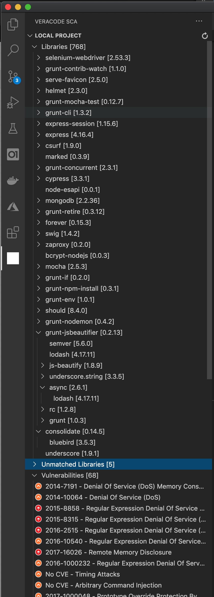

# Veracode SCA - VS Code plugin

A very simple plugin for Veracode SCA to get agent-base SCA results into VSCode IDE 

## Features

The current version is still lacking images to make it super nice, however, you can already have the following:

* Get a list of your workspaces
* Get a list of project within each of your workspaces - by selecting a workspace
* Get a list of issues within your individual project - by selecting a project

* Review current working directory (only if local SCA agent is installed and configured)

## Requirements

The extension is utilizing the credentials setup in your pc account home directory. 
See instructions in [Veracode Help](https://help.veracode.com/reader/LMv_dtSHyb7iIxAQznC~9w/zm4hbaPkrXi02YmacwH3wQ)

 
## Extension Settings

This extension contributes the following settings:

* `veracode.API profile in configuration file`: specify the `profile` to use from the credentials file (default profile is set to `default`)

## Known Issues

Images and icons need update

## Release Notes

### 0.0.3

- Add a view to refresh and view the local working folder for SCA libraries and vulnerabilities

### 0.0.2

- grouped issues by type
- update issues icons
- added configuration for selecting section in the credentials file

### 0.0.1

- Initial release of the plugin
- Can pull Workspaces, Projects, and Issues 

### future...

- add tooltip to issues
- add links to Veracode platform
- add links to issues description
- add next safe version information to libraries with vulnerabilities
  
(See repository issues for additional items)

-----------------------------------------------------------------------------------------------------------

## Feedback

- If you have an improvement idea or you found any defect, please add an 'issue' 

**Hope you find this plugin useful!**
